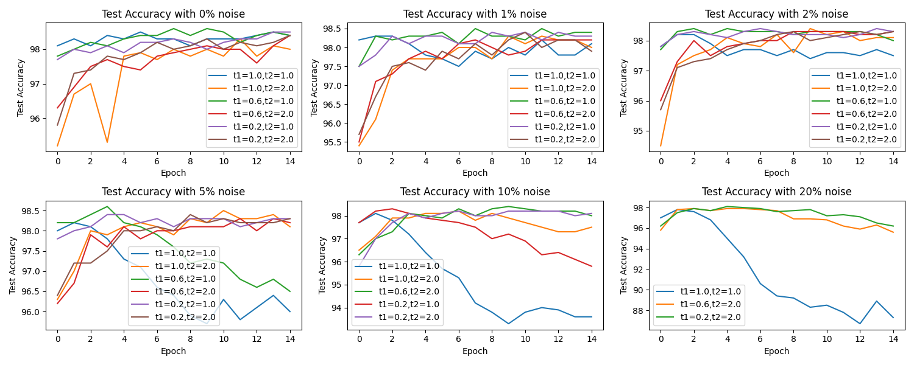

# Bi-Tempered Loss (Tensorflow)
This repository aims to give and example for using Bi-Tempered Loss to train the mnist data and try to analyze the effect of different t1 and t2. To be noticed, This repository contains the code from [Google](https://github.com/google/bi-tempered-loss) and [Kaggle](https://www.kaggle.com/nasirkhalid24/loss-functions-to-help-with-noisy-labelled-data). The code from [Google](https://github.com/google/bi-tempered-loss) did not contain the usage example. And the repo use tf.cond function to avoid (t1==1.0 and t2==1.0) condition which may give out the error. The code from [Kaggle](https://www.kaggle.com/nasirkhalid24/loss-functions-to-help-with-noisy-labelled-data) is used to plot the effect on different t1 and t2.

# Install Requirements
```
pip install -r requirements.txt
```

# Usage
1. Use Bi-Tempered Loss to train mnist dataset
    ```
    python main.py
    ```

2. Train your own example
    - Multi-classes classification
        ```
        from loss import BiTemeredLoss
        loss_object_bi = BiTemeredLoss(t1=0.2, t2=4.0, multi=True)
        loss_object_ce = tf.keras.losses.CategoricalCrossentropy()
        loss = loss_object_bi(labels, predictions)
        ```
    - Binary classification
        ```
        from loss import BiTemeredLoss
        loss_object_bi = BiTemeredLoss(t1=0.2, t2=4.0)
        loss_object_ce = tf.keras.losses.BinaryCrossentropy()
        loss = loss_object_bi(labels, predictions)
        ```

3. Test loss result from different t1, t2, label and prediction
    ```
    python loss.py
    ```
    

4. Test the effect on mnist traininf for different t1 and t2
    ```
    python eval_exec.py >> TrainingLog.txt # keep the training log
    python LogParser.py # parse the training log
    ```
    
    
    

